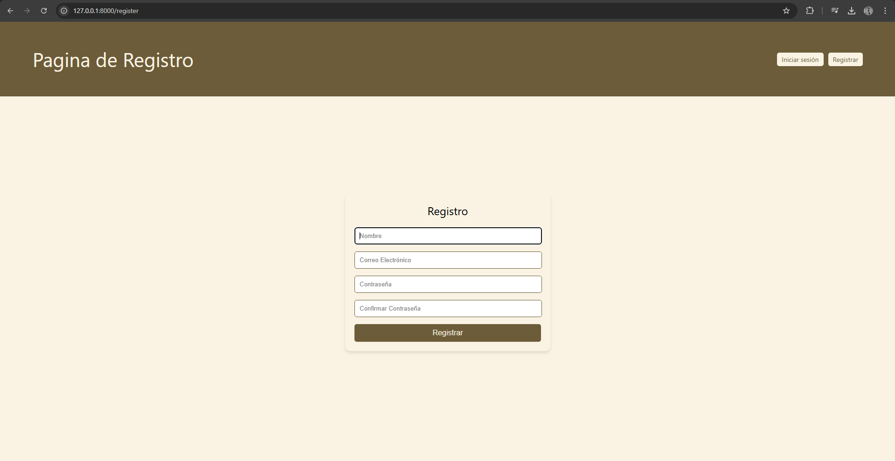
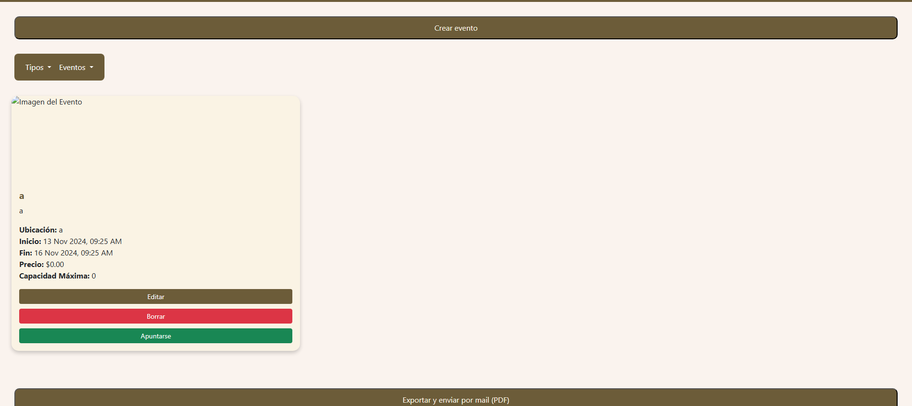

# Manual del Usuario

## Índice
1. [Página inicial](#pagina-inicial)
2. [Login](#login)
3. [Registro](#registro)
4. [Página principal](#pagina-principal)
5. [Eventos](#eventos)
6. [Filtro de categorías](#filtro-de-categorias)
7. [Filtro de eventos](#filtro-de-eventos)
8. [Crear eventos (ADMIN)](#crear-eventos-admin)
9. [Administración de usuarios (ADMIN)](#administracion-de-usuarios-admin)
10. [Editar eventos (ADMIN)](#editar-eventos-admin)
11. [Pruebas unitarias](#pruebas-unitarias)
   * [Register](#register)
   * [Login](#login)
   * [EventController](#eventcontroller)
12. [Endpoints](#endpoints)
   * [Registrar usuario]
   * [Login usuario]
   * [Usuario administrador]
   * [Conseguir todos los datos]
   * [Coger todos los usuarios]
   * [Coger usuario en especifico]
   * [Coger todos los eventos]
   * [Coger evento en especifico]
   * [Crear evento]
   * [Formulario del evento]
   * [Editar evento]
   * [Eliminar evento]
---

### Página inicial
En esta página podremos ver la página de inicio, en la cual tendremos en la parte superior derecha tanto el iniciar sesión como la opción de registrarse.

---

### Login
En la sección de login, los usuarios pueden ingresar su nombre de usuario y contraseña para acceder a la pagina. Si los datos son correctos, se le mandara a la página principal.

---

### Registro
En la sección de registro, los nuevos usuarios pueden crear una cuenta proporcionando su nombre de usuario, correo electrónico y contraseña. Luego de registrarse, recibirán un correo de confirmación.

---

### Página principal
Una vez iniciada la sesión, los usuarios serán enviados a la página principal, donde se presentarán diferentes opciones dependiendo de su rol. En esta pagina también podremos ver los eventos disponibles directamente, menos en los que ya estemos registraods 

---

### Eventos
En esta sección, los usuarios pueden ver los eventos disponibles en la pagina. Los eventos están organizados por categorías y se pueden consultar en detalle atraves de el filtro de eventos.

---

### Filtro de categorías
Los usuarios pueden filtrar los eventos según categorías, lo que facilita encontrar los eventos que les interesan.

Esta ventana esta enfocada en mostrar los eventos segun la categoría que hayas seleccionado, para asi tener un mejor manejo de los eventos.

---

### Filtro de eventos
Este filtro permite a los usuarios ver los eventos en los cuales esta actualmente registrado.

Podremos ver como en eventos registrados tendremos los eventos pertinentes en los que hayamos querido participar

---

### Crear eventos (ADMIN)
Los administradores pueden crear nuevos eventos desde esta sección, proporcionando detalles como el título, la fecha, la ubicación y la descripción del evento.

---

### Administración de usuarios (ADMIN)
Los administradores pueden gestionar las cuentas de los usuarios desde esta sección, donde pueden ver el listado de usuarios, editar y activar/desactivar la cuenta.

---

### Editar eventos (ADMIN)
Los administradores tienen la capacidad de editar los eventos existentes.

---
### Pruebas unitarias

#### **Register**

1. **Mostrar formulario de registro**  
   - **Objetivo:** Verificar que el formulario de registro se muestra correctamente cuando se accede a la ruta de registro.  
   - **Prueba:** Acceder a `/register` y comprobar que se carga la vista de registro.  
   - **Resultado esperado:** El servidor responde con un estado 200 y muestra la vista `auth.register`.

2. **Registro con datos válidos**  
   - **Objetivo:** Validar que un usuario puede registrarse correctamente con datos válidos.  
   - **Prueba:** Enviar un formulario de registro con un nombre, correo y contraseña válidos.  
   - **Resultado esperado:** El usuario es redirigido a la página de inicio (`/home`), se autentica automáticamente y se guarda el nuevo usuario en la base de datos.

3. **Registro con email duplicado**  
   - **Objetivo:** Comprobar que no se permita el registro de un usuario con un correo electrónico ya existente en la base de datos.  
   - **Prueba:** Intentar registrar a un usuario con el mismo correo que uno previamente registrado.  
   - **Resultado esperado:** El sistema muestra un error de validación en el correo electrónico y no permite completar el registro.

4. **Campos obligatorios**  
   - **Objetivo:** Asegurarse de que el sistema valide que todos los campos obligatorios (nombre, correo, contraseña) estén presentes.  
   - **Prueba:** Enviar el formulario de registro sin ningún dato.  
   - **Resultado esperado:** El sistema devuelve errores de validación indicando que los campos `name`, `email` y `password` son obligatorios.

5. **Confirmación de contraseña no coincide**  
   - **Objetivo:** Verificar que el sistema no permita el registro si las contraseñas no coinciden.  
   - **Prueba:** Enviar el formulario con una contraseña y una confirmación de contraseña diferentes.  
   - **Resultado esperado:** El sistema muestra un error de validación en el campo `password`.

6. **Email inválido**  
   - **Objetivo:** Asegurarse de que el sistema no permita el registro con un correo electrónico en un formato incorrecto.  
   - **Prueba:** Intentar registrar un usuario con un correo electrónico inválido (`email-invalido`).  
   - **Resultado esperado:** El sistema muestra un error de validación en el campo `email`.

---

#### **Login**

1. **Cargar formulario de login**  
   - **Objetivo:** Verificar que el formulario de login se muestra correctamente cuando se accede a la ruta de login.  
   - **Prueba:** Acceder a `/login` y comprobar que se carga la vista de login.  
   - **Resultado esperado:** El servidor responde con un estado 200 y muestra la vista `auth.login`.

2. **Iniciar sesión con credenciales válidas**  
   - **Objetivo:** Validar que un usuario puede iniciar sesión correctamente con un correo electrónico y contraseña válidos.  
   - **Prueba:** Ingresar las credenciales correctas de un usuario existente y verificar el inicio de sesión.  
   - **Resultado esperado:** El usuario es redirigido a la página de inicio (`/home`) y el sistema autentica al usuario correctamente.

3. **Iniciar sesión con credenciales inválidas**  
   - **Objetivo:** Asegurarse de que el sistema no permita el inicio de sesión con una contraseña incorrecta.  
   - **Prueba:** Ingresar un correo electrónico válido y una contraseña incorrecta.  
   - **Resultado esperado:** El sistema muestra errores de validación y no autentica al usuario.

4. **Validar campos obligatorios**  
   - **Objetivo:** Verificar que el sistema valide que los campos de correo electrónico y contraseña son obligatorios.  
   - **Prueba:** Enviar el formulario de login vacío.  
   - **Resultado esperado:** El sistema devuelve errores de validación indicando que los campos `email` y `password` son obligatorios.

5. **Correo electrónico inválido**  
   - **Objetivo:** Comprobar que el sistema no permita el inicio de sesión con un correo electrónico en un formato incorrecto.  
   - **Prueba:** Intentar iniciar sesión con un correo electrónico que no tenga un formato válido.  
   - **Resultado esperado:** El sistema muestra un error de validación en el campo `email`.

6. **Redirección correcta después del login**  
   - **Objetivo:** Asegurarse de que el sistema redirige correctamente al usuario después de un inicio de sesión exitoso.  
   - **Prueba:** Iniciar sesión con credenciales válidas y verificar que la redirección es correcta.  
   - **Resultado esperado:** El usuario es redirigido a la página de inicio (`/home`) después de un inicio de sesión exitoso.

---

#### **EventController**

1. **Mostrar formulario de creación de eventos**  
   - **Objetivo:** Verificar que el formulario de creación de eventos se muestra correctamente cuando se accede a la ruta de creación de eventos.  
   - **Prueba:** Acceder a `/events/create` como un usuario autenticado.  
   - **Resultado esperado:** El servidor responde con un estado 200 y muestra la vista `events.create_event`.

2. **Crear evento**  
   - **Objetivo:** Validar que un usuario pueda crear un evento correctamente.  
   - **Prueba:** Crear un evento con datos válidos, incluyendo una imagen.  
   - **Resultado esperado:** El servidor responde con un estado 201 y el evento se almacena en la base de datos. Además, la imagen se guarda correctamente en el almacenamiento.

3. **Validación de campos obligatorios al crear evento**  
   - **Objetivo:** Verificar que el sistema valide los campos obligatorios cuando se intenta crear un evento sin proporcionar los datos necesarios.  
   - **Prueba:** Intentar crear un evento sin datos (formulario vacío).  
   - **Resultado esperado:** El sistema devuelve un estado 422 y muestra errores de validación para los campos obligatorios.

4. **Eliminar evento**  
   - **Objetivo:** Comprobar que un usuario puede eliminar un evento correctamente.  
   - **Prueba:** Eliminar un evento creado por el usuario.  
   - **Resultado esperado:** El evento es eliminado (soft delete) y el sistema devuelve un estado 200.

5. **Suscribirse a un evento**  
   - **Objetivo:** Asegurarse de que un usuario pueda suscribirse a un evento correctamente.  
   - **Prueba:** Suscribir a un usuario a un evento.  
   - **Resultado esperado:** El sistema confirma la suscripción y se guarda en la base de datos con el estado `CONFIRMED`.

6. **Cancelar suscripción a un evento**  
   - **Objetivo:** Verificar que un usuario pueda cancelar su suscripción a un evento correctamente.  
   - **Prueba:** Cancelar la suscripción de un usuario a un evento al que previamente se había suscrito.  
   - **Resultado esperado:** La suscripción es cancelada y el estado de la suscripción se cambia a `CANCELLED`, marcando el registro como eliminado (soft delete).

---

### **Endpoints**
Aqui tendremos todos la información de lo que le tendremos que solicitar al postman, para poder obtener la informacion de cada endpoint.

Tener en cuenta de hacer cada postman en una ventana diferente

1. **Registrar usuario**
Post http://34.0.199.77:80/register

{
  "name": "tu nombre",
  "email": "tu correo",
  "password": "tu contraseña"
  "password_confirmation": "tu contraseña"
}

Al hacer esto le mandara un correo para verificar su usuario
Al registrar o loguear con un usuario cuando quiera hacerlo con otro usuario tendra que borrar las cookies

2. **Logear usuario**
Post http://34.0.199.77:80/login

{
  "email": "tu correo",
  "password": "tu contraseña"
}

Para hacer el siguiente paso tendra en postman que borrar las cookies del usuario en el con el que se ha registrado

3. **Usuario administrador**

{
  "email": "admin@admin.com",
  "password": "12345678"
}

4. **Conseguir todos los datos**
Get http://34.0.199.77:80/home

5. **Coger todos los usuarios**
Get http://34.0.199.77:80/home/users

6. **Coger usuario en especifico**
Get http://34.0.199.77:80/home/users/{id}

7. **coger todos los eventos**
Get http://34.0.199.77:80/home/events

8. **Coger evento en especifico**
Get http://34.0.199.77:80/home/events/{id}

9. **Crear evento**
Post http://34.0.199.77:80/events/create
(este en vez de con raw en body ahi que usar form-data)

Key	Value	Type
id	7	Text
title	Mi evento	Text
organized_id 1 Text
category_id	1	Text
description	Descripción...	Text
start_time	2025-03-15 10:00:00	Text
end_time	2025-03-15 12:00:00	Text
location	Ciudad	Text
latitude	40.416775	Text
longitude	-3.703790	Text
price	20.00	Text
max_attendees	100	Text
image	[elige el archivo de dentro de tu ordenandor]	File
deleted	0	Text
created_at 2025-03-15 10:00:00 Text
updated_at 2025-03-15 10:00:00 Text

10. **Conseguir el formulario del evento**
Get http://34.0.199.77:80/events/1/edit

11. **Editar evento**
Put http://34.0.199.77:80/events/"id"

{
  "title": "Evento Actualizado",
  "category_id": 2,
  "description": "Descripción actualizada",
  "start_time": "2025-03-15 11:00:00",
  "end_time": "2025-03-15 13:00:00",
  "location": "Otra Ciudad",
  "latitude": 40.416775,
  "longitude": -3.703790,
  "price": 25.00,
  "max_attendees": 150
}

12. **Eliminar evento**
Delete http://34.0.199.77:80/events/"id"