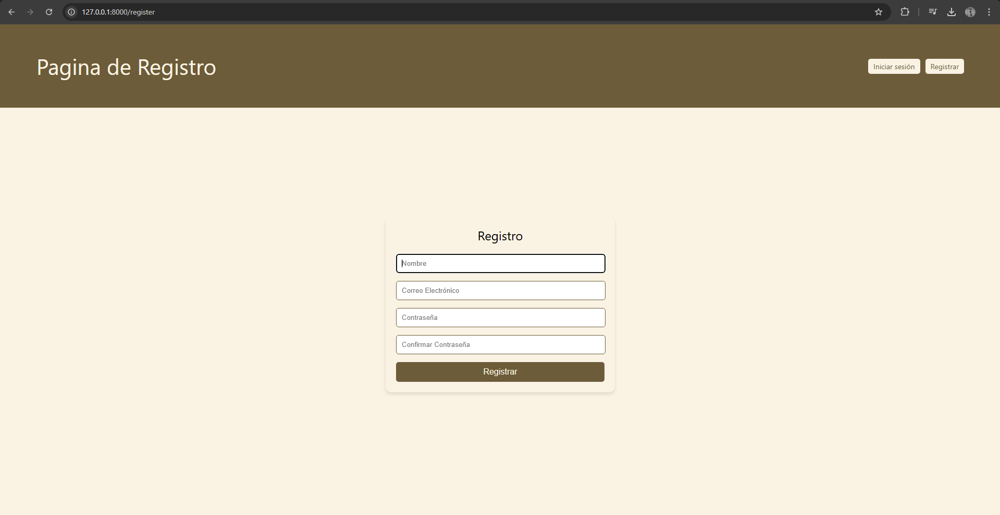
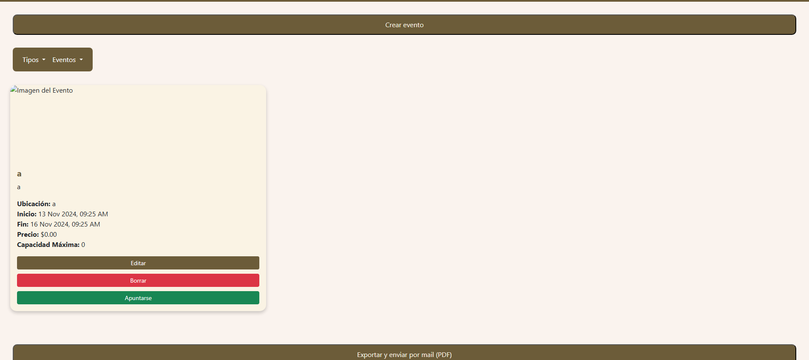

# Manual del Usuario

## Índice
1. [Página inicial](#pagina-inicial)
2. [Login](#login)
3. [Registro](#registro)
4. [Página principal](#pagina-principal)
5. [Eventos](#eventos)
6. [Filtro de categorías](#filtro-de-categorias)
7. [Filtro de eventos](#filtro-de-eventos)
8. [Crear eventos (ADMIN)](#crear-eventos-admin)
9. [Administración de usuarios (ADMIN)](#administracion-de-usuarios-admin)
10. [Editar eventos (ADMIN)](#editar-eventos-admin)

---

### Página inicial
En esta página podremos ver la página de inicio, en la cual tendremos en la parte superior derecha tanto el iniciar sesión como la opción de registrarse.

---

### Login
En la sección de login, los usuarios pueden ingresar su nombre de usuario y contraseña para acceder a la pagina. Si los datos son correctos, se le mandara a la página principal.

---

### Registro
En la sección de registro, los nuevos usuarios pueden crear una cuenta proporcionando su nombre de usuario, correo electrónico y contraseña. Luego de registrarse, recibirán un correo de confirmación.

---

### Página principal
Una vez iniciada la sesión, los usuarios serán enviados a la página principal, donde se presentarán diferentes opciones dependiendo de su rol. En esta pagina también podremos ver los eventos disponibles directamente, menos en los que ya estemos registraods 

---

### Eventos
En esta sección, los usuarios pueden ver los eventos disponibles en la pagina. Los eventos están organizados por categorías y se pueden consultar en detalle atraves de el filtro de eventos.

---

### Filtro de categorías
Los usuarios pueden filtrar los eventos según categorías, lo que facilita encontrar los eventos que les interesan.

Esta ventana esta enfocada en mostrar los eventos segun la categoría que hayas seleccionado, para asi tener un mejor manejo de los eventos.

---

### Filtro de eventos
Este filtro permite a los usuarios ver los eventos en los cuales esta actualmente registrado.

Podremos ver como en eventos registrados tendremos los eventos pertinentes en los que hayamos querido participar

---

### Crear eventos (ADMIN)
Los administradores pueden crear nuevos eventos desde esta sección, proporcionando detalles como el título, la fecha, la ubicación y la descripción del evento.

---

### Administración de usuarios (ADMIN)
Los administradores pueden gestionar las cuentas de los usuarios desde esta sección, donde pueden ver el listado de usuarios, editar y activar/desactivar la cuenta.

---

### Editar eventos (ADMIN)
Los administradores tienen la capacidad de editar los eventos existentes.

